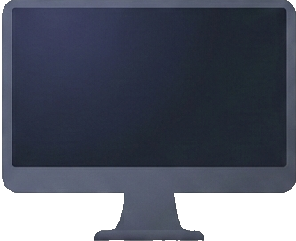
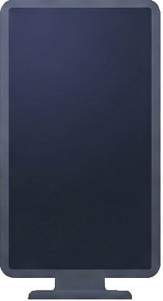

<div align="center">

# 🖥️ Custom Layout Monitors

### Gestiona y personaliza la disposición de tus monitores con facilidad

[](https://dotnet.microsoft.com/)
[](https://docs.microsoft.com/en-us/dotnet/desktop/wpf/)
[](LICENSE)


</div>

---

## 📋 Descripción

**Custom Layout Monitors** es una aplicación de escritorio para Windows que te permite crear, guardar y activar diferentes configuraciones de monitores con un solo clic. Ideal para usuarios con múltiples pantallas que necesitan cambiar frecuentemente entre diferentes disposiciones.

### ✨ Características principales

| Característica | Descripción |
|----------------|-------------|
| 🎨 **Perfiles personalizados** | Crea y guarda múltiples configuraciones de monitores |
| 👁️ **Vista previa 3D** | Visualiza tus monitores con efecto de perspectiva 3D |
| ⚡ **Activación rápida** | Cambia entre perfiles con un solo clic |
| 🖼️ **Interfaz moderna** | UI elegante con diseño glassmorphism y tema oscuro |
| 💾 **Persistencia** | Tus perfiles se guardan automáticamente en JSON |
| 🔄 **Detección automática** | Detecta automáticamente los monitores conectados |

---

## 🖼️ Capturas de pantalla

### Interfaz principal
La aplicación muestra tus perfiles guardados en tarjetas con vista previa de la configuración de monitores:

<div align="center">

</div>

### Vista previa 3D
Los monitores exteriores se muestran con un efecto de inclinación 3D para una visualización más realista:

<div align="center">


</div>

---

## 🚀 Instalación

### Requisitos previos
- Windows 10/11
- [.NET 8.0 Runtime](https://dotnet.microsoft.com/download/dotnet/8.0)

### Pasos de instalación

1. **Clona el repositorio**
   ```bash
   git clone https://github.com/alejandrop1105/Custom-Layout-Monitors.git
   cd Custom-Layout-Monitors
   ```

2. **Compila el proyecto**
   ```bash
   dotnet build
   ```

3. **Ejecuta la aplicación**
   ```bash
   dotnet run
   ```

---

## 🛠️ Tecnologías utilizadas

<div align="center">

| Tecnología | Uso |
|------------|-----|
|  | Lenguaje principal |
|  | Framework de UI |
|  | Runtime |
|  | Diseño de interfaces |

</div>

---

## 📁 Estructura del proyecto

```
Custom Layout Monitors/
├── 📂 Assets/              # Recursos gráficos (iconos, imágenes)
├── 📂 Controls/            # Controles personalizados WPF
│   └── Monitor3DView.xaml  # Control de visualización 3D
├── 📂 Converters/          # Convertidores XAML
├── 📂 Models/              # Modelos de datos
│   ├── DisplayProfile.cs   # Modelo de perfil
│   └── MonitorVisualItem.cs # Modelo de monitor
├── 📂 Services/            # Servicios de la aplicación
│   ├── DisplayService.cs   # Servicio de gestión de displays
│   └── Native/             # Interop con Windows API
├── 📂 Utils/               # Utilidades
│   ├── JsonStorage.cs      # Persistencia de datos
│   └── ProfileVisualizer.cs # Generación de vistas previas
├── 📂 ViewModels/          # ViewModels (MVVM)
├── MainWindow.xaml         # Ventana principal
└── App.xaml                # Configuración de la aplicación
```

---

## 🎯 Uso

1. **Crear un perfil**: Haz clic en el botón "+" para crear un nuevo perfil
2. **Configurar monitores**: Arrastra y organiza tus monitores en la vista previa
3. **Guardar**: Dale un nombre descriptivo y guarda el perfil
4. **Activar**: Haz clic en "Activar" en cualquier tarjeta de perfil para aplicar esa configuración

---

## 🤝 Contribuciones

Las contribuciones son bienvenidas. Por favor, abre un issue primero para discutir los cambios que te gustaría realizar.

---

## 📄 Licencia

Este proyecto está bajo la Licencia MIT. Ver el archivo [LICENSE](LICENSE) para más detalles.

---

<div align="center">

**Desarrollado con ❤️ por [Alejandro](https://github.com/alejandrop1105)**

</div>
